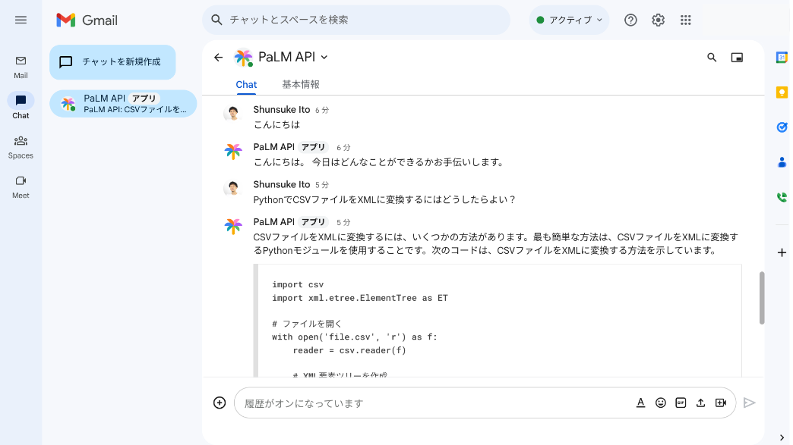
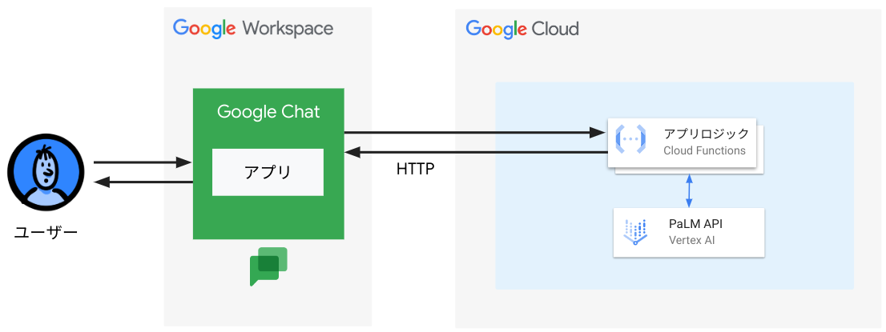
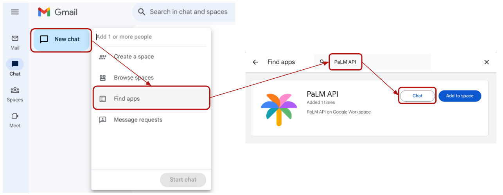

# 概要
Google WorkspaceのChatよりPaLM APIを呼び出す

# 作成物イメージ


# アーキテクチャ


# 参考
Chat APIよりCloud Functionsを呼び出す

https://developers.google.com/chat/quickstart/gcf-app?hl=ja

Cloud Functionsにて呼び出し元がChat APIで有ることを検証

https://developers.google.com/chat/api/guides/message-formats?hl=ja#handle_events_from

# 前提
- Google WorkspaceのチャットとGoogle Cloud Platformが使えること

# 手順
## Cloud Functions

[APIを有効化](https://console.cloud.google.com/apis/enableflow?apiid=cloudbuild.googleapis.com,artifactregistry.googleapis.com,cloudfunctions.googleapis.com,aiplatform.googleapis.com)する
- Cloud Build API
- Artifact Registry API
- Cloud Functions API
- Vertex AI API

### ソースコード準備

```shell
git clone git@github.com:shun99/google-cloud-samples/chatapi-palm.git
```

- [verify_token.py](./verify_token.py)

  AUDIENCEにGCPのProject番号を指定

- [chat.py](./chat.py)

  project_idにGCPのProject IDを指定

### gcloud準備
```shell
gcloud init
gcloud auth application-default login
```

### Python環境準備
仮想環境を作成し有効化
```shell
cd your-project
python3 -m venv env
source env/bin/activate
```

(参考)無効化
```shell
deactivate
```

### ライブラリのインストール
```shell
pip install -r requirements.txt
PATH=$PATH:~/.local/bin
```

### ローカル実行
```shell
functions-framework --target hello_chat
```
localhost:8080で開くと呼び出し元チェックを入れているた403エラーになる

呼び出し元チェックスキップ環境変数設定し再度起動
```shell
export SKIP_VERIFICATION=True
functions-framework --target hello_chat
```
呼び出しに成功する

### Cloud Functionsのデプロイ
```
gcloud functions deploy <任意のFunction名> \
--gen2 \
--runtime=python311 \
--region=<リージョン> \
--source=. \
--entry-point=hello_chat \
--trigger-http \
--allow-unauthenticated
```

Cloud Functions内で呼び出し元がChat APIであることをヘッダー内のBearerトークンを使って検証しています。

デプロイしたurlをブラウザから実行すると500エラーが返ってくることを確認

## Chat API設定
[Chat API](https://console.cloud.google.com/marketplace/product/google/chat.googleapis.com)を開く

[`有効化`] → [`管理`] → [`構成`]の順に選択

各種設定を行う
- 任意の`アプリ名`を指定
- `アバターのUrl`にGoogle Chatで表示されるアイコンを指定
- アプリの`説明`を記載
- 下記設定を有効に
  - 1:1のメッセージを受信する
  - スペースとグループの会話に参加する
  - エラーをLoggingに記録する
- `アプリのUrl`にデプロイしたCloud FunctionsのUrlを指定
- `公開設定`でChatよりこのアプリを使わせたいユーザーを指定

# 動作確認
