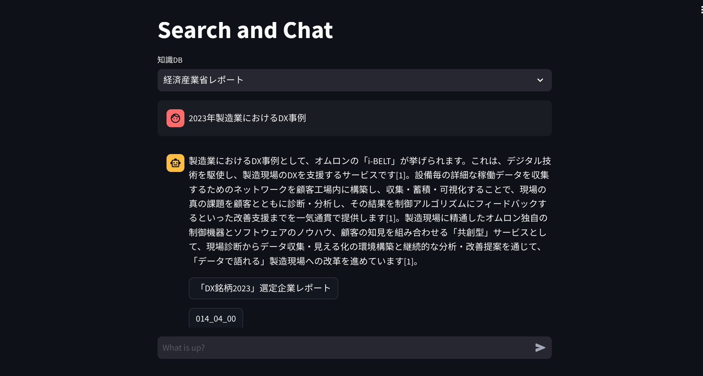
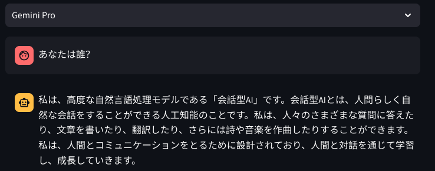

# 概要
StreamlitのChat UIからGemini/PaLM/Vertex AI Searchを呼び出す。
動くことを確認したらCloud Runへデプロイ。

# 作成物イメージ
Vertex AI Search選択時



Gemini Pro選択時



# 前提
- gcloud
- pip

# 手順
## Vertex AI Searchデータストアを作成
https://cloud.google.com/generative-ai-app-builder/docs/try-enterprise-search


## アプリ準備
### gcloud準備
```shell
gcloud init
gcloud auth application-default login
```

### Python環境準備
仮想環境を作成し有効化
```shell
cd your-project
python3 -m venv env
source env/bin/activate
```

無効化する場合は
```shell
deactivate
```

## ライブラリ導入
### インストール
```shell
pip install streamlit
pip install google-cloud-aiplatform
```

※requirements.txtがある場合
```shell
pip install -r requirements.txt
```

### ソースコード準備
[main.py](./main.py)

### ローカル起動
```shell
streamlit run main.py --server.enableCORS=false
```

ポート8501で開く

### requirements.txt作成
```shell
pip freeze > requirements.txt
```

## Cloud Runへデプロイ
### Procfile作成
[Procfile](./Procfile)

### API有効化
```shell
gcloud services enable compute.googleapis.com run.googleapis.com \
    artifactregistry.googleapis.com cloudbuild.googleapis.com
```

### Cloud Runへデプロイ
```shell
gcloud run deploy my-app --region "<リージョン>" --source . \
    --update-env-vars GOOGLE_CLOUD_PROJECT="<プロジェクトID>",MODEL_LOCATION="<リージョン>",DATA_STORE_ID="<データストアID>" 
    --allow-unauthenticated --quiet
```